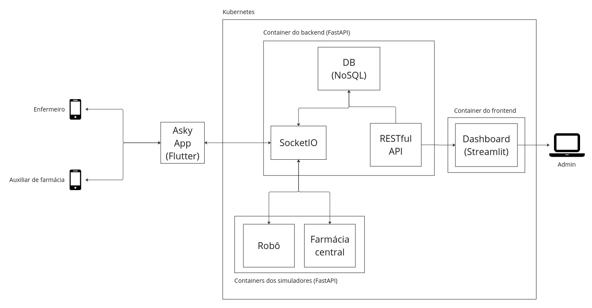

# Arquitetura da solução

A arquitetura do Asky foi projetada para fornecer uma solução robusta e escalável, que endereça as necessidades de comunicação e solicitação de urgências no sistema de reabastecimento de medicamentos no Hospital Sírio-Libanês. A infraestrutura é construída sobre o Kubernetes, oferecendo alta disponibilidade e permitindo a escalabilidade dos serviços. Esta documentação oferece uma visão detalhada da composição e interação entre os componentes da arquitetura.
Componentes da Arquitetura

A arquitetura do Asky é composta pelos seguintes elementos principais:

- **Asky App (Flutter):** Um aplicativo móvel desenvolvido utilizando o framework Flutter, que proporciona uma interface de usuário intuitiva tanto para enfermeiros quanto para auxiliares de farmácia. Este app é o ponto de interação direta com o usuário final.
- **Container do Backend (FastAPI):** Este container executa o backend do sistema desenvolvido com FastAPI, um framework de alta performance para construir APIs com Python 3.7+ com suporte a async.
  - *DB (NoSQL):* Uma base de dados NoSQL é utilizada para armazenar informações de maneira flexível e escalável. Este banco de dados gerencia o estado dos medicamentos, solicitações e registros de operações.
  - *SocketIO:* Utilizado para comunicação em tempo real entre o backend e o aplicativo móvel, permitindo que as notificações e atualizações sejam transmitidas instantaneamente.
  - *RESTful API:* Interfaces de programação de aplicações que seguem o estilo arquitetônico REST. São utilizadas para a comunicação entre diferentes componentes do sistema.
- **Containers dos Simuladores (FastAPI):** Simulam as operações do robô de separação de medicamentos e da farmácia central, permitindo testes e simulações no desenvolvimento e integração do sistema.
    - *Robô:* Simula o robô separador que executa a seleção e separação dos medicamentos solicitados.
    - *Farmácia Central:* Simula o sistema da farmácia central que gerencia o estoque principal de medicamentos e coordena o reabastecimento dos Pyxis.
- **Dashboard (Streamlit):** Uma aplicação de frontend desenvolvida com Streamlit, uma ferramenta que permite criar dashboards interativos facilmente com Python. O dashboard é destinado ao uso administrativo, oferecendo visualizações e insights sobre o sistema, permitindo monitoramento e análise de dados em tempo real.
  
## Fluxo de operação

O fluxo de operação na arquitetura do Asky procede da seguinte maneira:

1. **Solicitação de Reabastecimento:** Quando um enfermeiro identifica a necessidade de reabastecer um Pyxis, ele utiliza o Asky App para escanear o QR Code correspondente, automaticamente preenchendo e enviando a solicitação de reabastecimento.
2. **Processamento da Solicitação:** A solicitação é recebida pelo backend via SocketIO e registrada no DB NoSQL.
3. **Comunicação com Simuladores:** Através da RESTful API, o backend comunica-se com os simuladores da farmácia central e do robô para processar a solicitação.
4. **Dashboard Administrativo:** Todas as operações são registradas e podem ser visualizadas pelo administrador no dashboard, onde é possível obter métricas e insights operacionais.
5. **Notificação aos Usuários:** Enfermeiros e auxiliares de farmácia recebem notificações sobre o status de suas solicitações em tempo real através do Asky App.