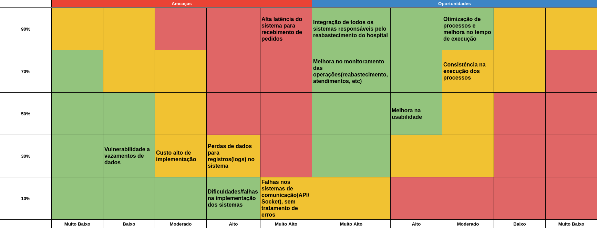

# Matriz de Riscos

A matriz de risco ajuda a identificar e priorizar os riscos com base em sua probabilidade e impacto. Os riscos são geralmente classificados em categorias como baixo, médio e alto, tanto para probabilidade quanto para impacto. Isso permite que as partes interessadas concentrem seus esforços na mitigação dos riscos mais significativos e críticos para o sucesso do projeto ou da organização.

## Riscos e plano de contingência

**1. Alta latência do sistema para recebimento de pedidos:**
- **Contingência:** Monitoramento contínuo da latência do sistema através de ferramentas de monitoramento de desempenho. Estabelecimento de alertas automáticos para identificar picos de latência. Implementação de redundância nos servidores para distribuir a carga de pedidos e mitigar possíveis gargalos.

**2. Vulnerabilidade a vazamentos de dados:**
- **Contingência:** Implementação de medidas de segurança robustas, como criptografia de dados em repouso e em trânsito, autenticação de dois fatores para acessos sensíveis, e auditorias regulares de segurança. Desenvolvimento de políticas de segurança da informação e treinamento regular dos funcionários para conscientização sobre segurança cibernética.

**3. Custo alto de implementação:**
- **Contingência:** Realização de uma análise detalhada dos custos de implementação para identificar áreas de otimização e redução de despesas. Exploração de opções de financiamento, como parcerias estratégicas, investimento externo ou financiamento governamental. Priorização de funcionalidades essenciais para o MVP (Minimum Viable Product) e escalonamento do projeto conforme disponibilidade orçamentária.

**4. Perdas de dados para registros (logs) no sistema:**
- **Contingência:** Implementação de backups regulares e automatizados dos registros (logs) do sistema em locais seguros e isolados. Utilização de sistemas de replicação de dados em tempo real para garantir a disponibilidade dos registros mesmo em caso de falha de hardware. Monitoramento constante da integridade dos backups e realização de testes de recuperação periódicos para garantir a eficácia do processo.

**5. Dificuldades/falhas na implementação dos sistemas:**
- **Contingência:** Adoção de uma abordagem iterativa e incremental para o desenvolvimento do sistema, com ciclos curtos de feedback e ajustes constantes. Formação de uma equipe multifuncional com experiência diversificada em desenvolvimento de software, incluindo especialistas em UX/UI, QA e gerenciamento de projetos. Estabelecimento de um plano de contingência detalhado, com cronogramas flexíveis e alternativas para possíveis obstáculos durante o processo de implementação.

**6. Falhas nos sistemas de comunicação (API/Socket), sem tratamento de erros:**
- **Contingência:** Implementação de mecanismos de detecção e tratamento de erros robustos nos sistemas de comunicação, incluindo protocolos de retry, fallbacks e circuit breakers. Monitoramento em tempo real da integridade das comunicações e alertas automáticos para identificar falhas. Desenvolvimento de documentação abrangente sobre as APIs e protocolos de comunicação para facilitar a resolução rápida de problemas por parte da equipe técnica.

## Oportunidades

**1. Integração de todos os sistemas responsáveis pelo reabastecimento do hospital;**

**2. Otimização de processos e melhora no tempo de execução;**

**3. Melhora no monitoramento das operações(reabastecimento, atendimentos, etc);**

**4. Consistência na execução dos processos;**

**5. Melhora na usabilidade.**