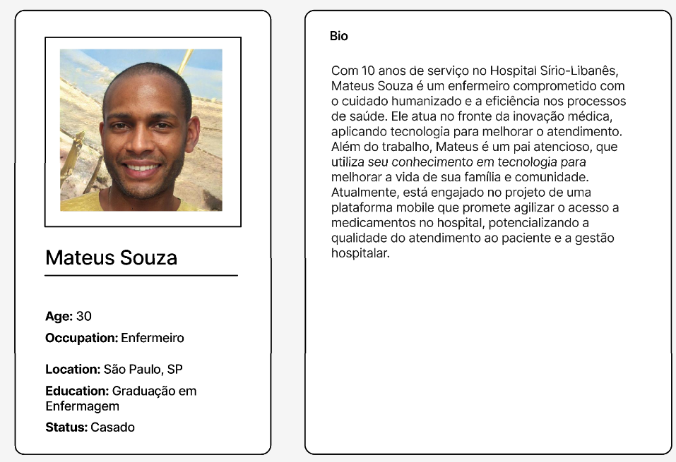
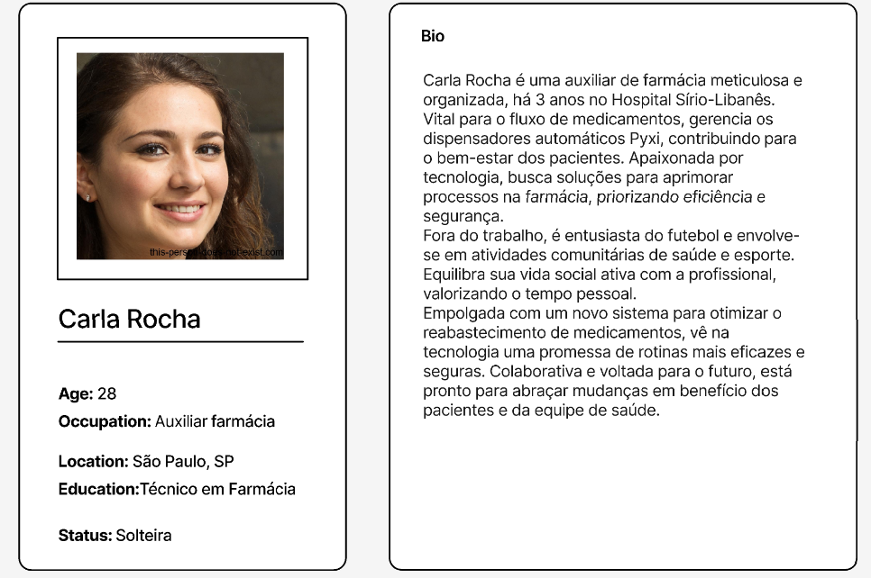
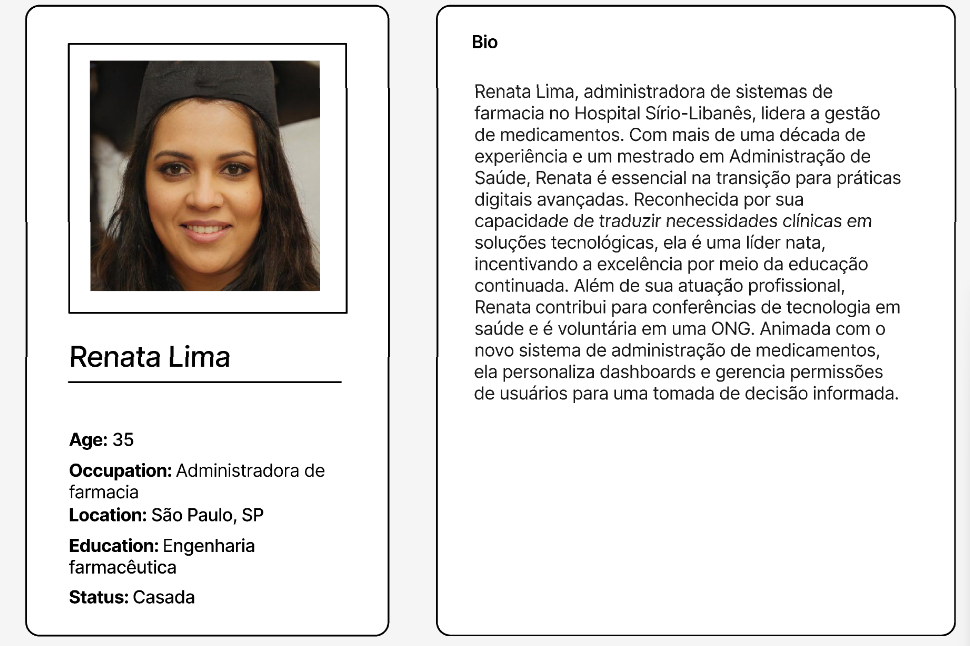

# Personas

## Introdução

Personas são ferramentas fundamentais no design de experiência do usuário, marketing e desenvolvimento de produto, representando grupos-chave de usuários com características, necessidades e comportamentos específicos. Essas representações ajudam equipes a se manterem focadas nos requisitos reais dos usuários, orientando o desenvolvimento de soluções mais eficazes e personalizadas. Ao criar personas detalhadas, os profissionais conseguem visualizar melhor quem são seus usuários finais, quais são seus desafios diários, suas motivações e como preferem interagir com produtos ou serviços. Isso facilita a criação de estratégias mais alinhadas com as expectativas e necessidades do público-alvo, permitindo uma conexão mais profunda e significativa entre usuários e soluções oferecidas.

### Personas Detalhadas

<h1>Mateus Souza - Enfermeiro</h1>

- Profissão: Enfermeiro no Hospital Sírio-Libanês
- Experiência: 10 anos de serviço
- Desafios:
    - Agilizar requisições de medicamentos
    - Reduzir espera e incerteza na entrega
- Busca por:
    - Sistema rápido e confiável
    - Minimização de interrupções na rotina
    - Interface simples, fácil e intuitiva

<h1>Carla Rocha - Auxiliar de farmácia</h1>

- Profissão: Auxiliar de Farmácia no Hospital Sírio-Libanês
- Experiência: 3 anos de atuação
- Desafios:
    - Validar pedidos de medicamentos de maneira eficiente
    - Conciliar validações com outras tarefas sem interrupções
- Busca por:
    - Sistema de validação de pedidos com poucos cliques
    - Possibilidade de multitarefa durante a validação
    - Interface que seja visual, simples e informativa

<h1>Renata Lima - Administradora de sistemas de farmacia</h1>

- Profissão: Administradora de Sistemas de Farmácia
- Local de Trabalho: Hospital Sírio-Libanês
- Experiência: Mais de uma década, com mestrado em Administração de Saúde
- Desafios:
    - Entender indicadores de operação detalhadamente
    - Necessidade de relatórios descarregáveis para análise
    - Visão rápida e clara da situação geral da equipe
- Busca por:
    - Sistema que mapeie indicadores com precisão
    - Interface intuitiva para visualização e acesso a dados
    - Dashboards personalizáveis para decisões informadas
- Soluções Desejadas:
    - Profundidade analítica
    - Informação valiosa para insights operacionais
    - Praticidade no uso diário do sistema

Essas personas ilustram a diversidade dos usuários e suas distintas necessidades, servindo como base para o desenvolvimento de produtos e serviços mais alinhados com as expectativas do público-alvo.