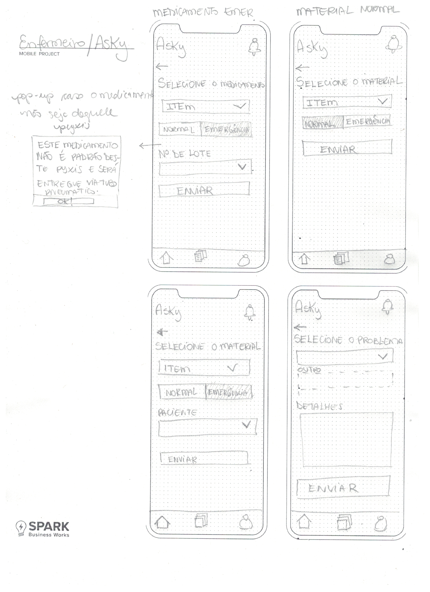
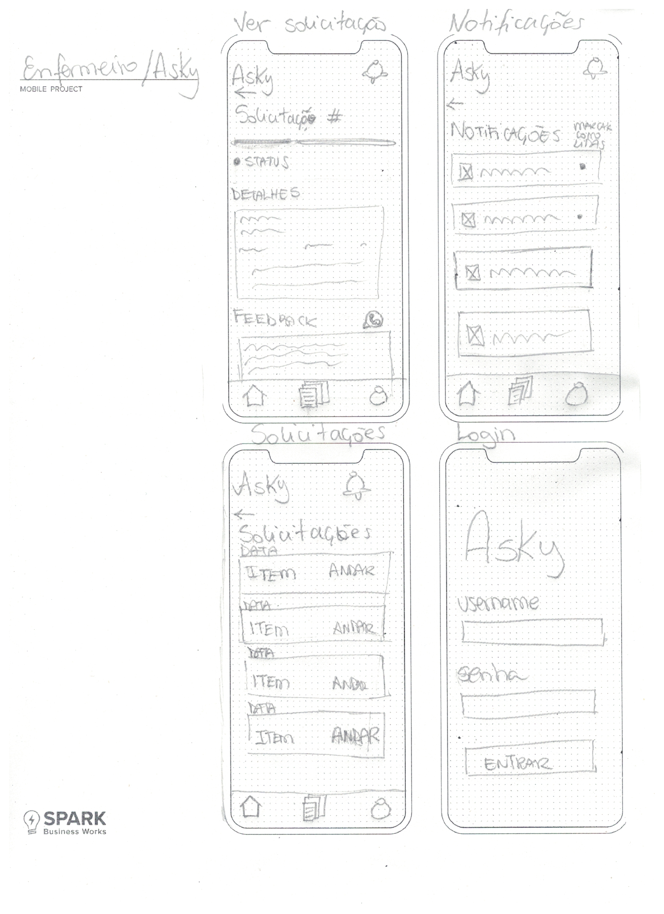

# Wireframe Mobile

## Fluxo Enfermeiro

Este wireframe representa a primeira parte do fluxo do enfermeiro no aplicativo Asky, otimizado para agilizar o processo de solicitação de reabastecimento de medicamentos através do uso de QR Codes.

Ao abrir o aplicativo, o enfermeiro se depara com uma interface limpa e simples. O destaque é o botão central "Nova Solicitação", que o incentiva a iniciar seu pedido imediatamente. Abaixo, há uma seção resumida mostrando a "Última Solicitação", permitindo que o enfermeiro monitore o pedido mais recente de forma rápida e eficiente.

Ao clicar em “Nova Solicitação”, o enfermeiro é levado a uma tela com instruções para escanear o QR Code do Pyxis. O escaneamento automático visa preencher todos os dados necessários para a solicitação, minimizando o esforço manual e reduzindo o potencial de erros de entrada de dados.

Os dois wireframes de cima representam a primeira parte do fluxo do enfermeiro no aplicativo Asky, otimizado para agilizar o processo de solicitação de reabastecimento de medicamentos através do uso de QR Codes.
Ao abrir o aplicativo, o enfermeiro se depara com uma interface limpa e simples. O destaque é o botão central "Nova Solicitação", que o incentiva a iniciar seu pedido imediatamente. Abaixo, há uma seção resumida mostrando a "Última Solicitação", permitindo que o enfermeiro monitore o pedido mais recente de forma rápida e eficiente.
Ao clicar em “Nova Solicitação”, o enfermeiro é levado a uma tela com instruções para escanear o QR Code do Pyxis. O escaneamento automático visa preencher todos os dados necessários para a solicitação, minimizando o esforço manual e reduzindo o potencial de erros de entrada de dados.

Após a leitura do QR Code, o usuário é redirecionado para uma tela onde pode selecionar a natureza do pedido: "Medicamento", "Material" ou "Assistência". Essa categorização foi implementada para garantir que o pedido seja encaminhado para a área correta, aprimorando a precisão e a eficiência do processo de reabastecimento. Essa decisão foi resultado de um feedback importante do nosso parceiro. Inicialmente, havíamos considerado apenas medicamentos para as solicitações, porém, durante a revisão, identificamos diferentes fluxos para o reabastecimento de medicamentos, materiais ou pedidos de assistência, como aqueles relacionados a portas de dispenser emperradas. Por isso, desenvolvemos uma tela adicional para a definição do tipo de pedido.

A quarta tela corresponde ao fluxo de solicitação de um medicamento. Nela, o usuário precisa preencher apenas dois campos. O primeiro é o nome do medicamento, selecionado a partir de uma lista dropdown já filtrada para conter apenas os medicamentos disponíveis naquele PYxis, reduzindo a necessidade de busca adicional. O segundo campo é para indicar se a solicitação deve seguir o fluxo normal ou ser marcada como emergencial. No caso de emergência, o medicamento será entregue não através do reabastecimento no dispense Pyxis, o que pode levar cerca de uma hora, mas sim através de tubo pneumático, chegando em poucos minutos.

Nessa última tela, no entanto, contemplamos ainda o fluxo normal. A minimização do número de interações e informações é essencial, pois a demora no preenchimento de dados é uma das principais preocupações dos nossos usuários. Essa questão é em grande parte mitigada pelo fato de que os dados de credenciamento são recuperados do login do aplicativo, enquanto os dados do PYxis são extraídos do QR Code.

No caso do medicamento marcado como emergencial, é necessário preencher um campo adicional: o número de lote da prescrição. Isso se deve ao fato de que, no fluxo normal, o medicamento seria inicialmente colocado no dispenser seguro antes de ser retirado pelo enfermeiro. Nesse caso, ao usar o PYxis para retirar o medicamento, o enfermeiro precisaria informar o paciente destinatário. Porém, no caso do medicamento emergencial, que é entregue através do tubo pneumático, o enfermeiro pode retirar o medicamento imediatamente, sendo necessário fornecer o número de lote da prescrição desde o início para garantir a rastreabilidade e segurança do processo.

Na segunda tela, trata-se do fluxo de material com prioridade normal. Novamente, é apenas necessário informar o item em si, pois ele será reabastecido no dispenser seguro, sem a necessidade de informações adicionais.

No caso de material marcado como emergencial (tela 3), é necessário identificar o paciente diretamente, pois não são emitidos números de lote para materiais. Essa medida visa assegurar que o material seja entregue de forma correta e controlada.

Por fim, a tela 4 corresponde ao fluxo de assistência. Nesta tela, é possível selecionar um dos problemas mais comuns em um dropdown, com a opção de personalizar uma seleção "Outros". Além disso, há um campo opcional para fornecer mais detalhes sobre o problema selecionado. Essa abordagem visa fornecer ao usuário a flexibilidade de descrever o problema de forma mais detalhada, se necessário, garantindo uma comunicação clara e eficaz entre o enfermeiro e a equipe responsável pela assistência.

Além das telas mencionadas, também desenvolvemos uma tela de visualização detalhada de uma solicitação. Nesse caso, optamos por um design mais semelhante ao utilizado no aplicativo iFood, com uma sequência de breadcrumbs e um texto explicativo abaixo. Essa abordagem visa gerar mais familiaridade com o usuário e facilitar a navegação através das etapas da solicitação. O campo para detalhes e feedback do auxiliar de farmácia permaneceu inalterado, garantindo a continuidade da interação entre os usuários. Ao lado do título “Feedback”, há ainda um botão para redirecionamento ao canal Whatsapp, para solucionar dúvidas maiores.

Adicionalmente, incluímos uma tela de notificações de solicitação, acessível a qualquer momento através do ícone de sino localizado no canto superior direito do aplicativo. Nessa tela, ao clicar em qualquer card de notificação, o usuário é redirecionado para a solicitação associada a ele, permitindo uma rápida visualização e acompanhamento do progresso das solicitações.

Por fim, também implementamos uma tela de visualização do histórico de solicitações, com o mínimo de informações necessárias para uma rápida referência. Essa tela foi projetada para fornecer ao usuário um panorama geral de suas solicitações anteriores, com foco na eficiência e praticidade.

Além disso, adicionamos uma tela de login com campos para usuário e senha. Não foi necessário desenvolver uma tela de cadastro, pois todos os usuários serão criados pelo administrador após o credenciamento do colaborador. Essa abordagem simplifica o processo de entrada no aplicativo, garantindo uma transição suave para os usuários.

### Justificativa geral para o fluxo de enfermeiro

Nossas escolhas de design para o aplicativo Asky foram fundamentadas em princípios de UX bem estabelecidos, como as heurísticas de Nielsen e as leis da Gestalt, com o objetivo de criar uma interface que seja intuitiva, eficiente e adaptada às necessidades específicas dos usuários finais.
Visibilidade do status do sistema: A tela inicial do aplicativo exibe a última solicitação com seu status atual, mantendo o enfermeiro informado e reduzindo a ansiedade do usuário. Isso segue a heurística de visibilidade do status do sistema, garantindo que o usuário sempre saiba o que está acontecendo.
Controle do usuário e liberdade: Ao fornecer escolhas claras e distintas para solicitar "Medicamentos", "Material" ou "Assistência", damos aos enfermeiros o controle sobre o fluxo do aplicativo. Em qualquer ponto, eles podem retornar ao passo anterior, cancelar ou alterar sua escolha, apoiando a heurística de controle do usuário e liberdade.
Consistência e padrões: As telas seguem uma estrutura e terminologia consistentes, assegurando que os usuários não se confundam com termos ou ações inesperadas. Isso está em harmonia com a heurística de consistência e padrões.
Prevenção de erros: A seleção de medicamentos a partir de uma lista preenchida previamente minimiza a possibilidade de erros, alinhando-se com a heurística de prevenção de erros. A distinção entre pedidos normais e emergenciais é simplificada, reduzindo o risco de ações incorretas.
Fechamento: As telas são projetadas de forma a completar visualmente o grupo de ações, como a seleção de medicamento ou material, proporcionando um senso de conclusão a cada passo dado pelo usuário.
Continuidade: O fluxo de ação de uma tela para outra segue um caminho claro e lógico, garantindo que os usuários sintam um senso de direção contínua à medida que navegam pelo aplicativo.

## Fluxo Auxiliar de Fármacia

Nesta série de wireframes, estamos vendo a interface do aplicativo Asky do ponto de vista do auxiliar de farmácia. O design reflete uma estrutura funcional e eficiente, visando facilitar o gerenciamento das solicitações de reabastecimento e o acompanhamento do fluxo de trabalho.

### Explicação por tela:

**Home**

A interface do aplicativo Asky foi estrategicamente projetada para otimizar o fluxo de trabalho do auxiliar de farmácia. Com uma disposição clara e lógica das solicitações de reabastecimento, a tela inicial divide-se em "Novas" e "Em Andamento", proporcionando uma visão instantânea das tarefas que necessitam de atenção imediata. Na seção "Novas", os pedidos recentes são exibidos, cada um com detalhes cruciais como o nome do medicamento ou material e o local específico do dispenser, além de ícones que indicam o status do pedido. O ícone de 'aceite' em cada cartão é uma ferramenta interativa estratégica, concebida para permitir que o auxiliar escolha e se responsabilize por uma nova solicitação, alinhando o design com a eficiência operacional e a justa distribuição de tarefas.

Quando o auxiliar de farmácia opta por aceitar uma solicitação, ele ativa uma sequência de processos bem coordenados. Este ato de aceitação não só confirma a responsabilidade assumida pelo auxiliar mas também comunica ao sistema que a tarefa será manuseada especificamente por ele. Imediatamente após essa ação, a solicitação é transferida para a seção "Em Andamento" na interface do auxiliar responsável e é removida da visão dos demais, prevenindo redundância no atendimento e assegurando uma gestão eficiente do fluxo de reabastecimento. Este sistema reflete uma aplicação prática das heurísticas de UX, enfatizando a autonomia do usuário e a clareza nas etapas do processo.

**Histórico**
A tela de histórico apresenta um log das solicitações passadas, oferecendo um registro visual do que foi completado. Isso não apenas ajuda na rastreabilidade e na contabilidade de tarefas anteriores, mas também na identificação de padrões de demanda, o que pode ser crucial para ajustes futuros no inventário e na previsão de necessidades.

**Visualização de Solicitação**
Quando um item é selecionado, o auxiliar de farmácia é levado a uma tela detalhada da solicitação. Aqui, ele pode ver o status atualizado e informações adicionais, proporcionando um entendimento completo do que é necessário. A funcionalidade de atualizar o status diretamente na tela é uma adição prática, promovendo eficiência ao permitir que o auxiliar marque o progresso das tarefas sem sair da visão atual.

Um campo para escrever feedback está disponível na mesma tela, incentivando a comunicação contínua e direta entre o enfermeiro e o auxiliar de farmácia. Este é um aspecto vital para melhorar a colaboração e a qualidade do serviço, além de ser uma fonte rica de dados para aprimoramento do sistema.

**Login**
Finalmente, há uma tela de login simples e direta, reforçando a segurança e a personalização do aplicativo. Esta tela garante que apenas pessoal autorizado tenha acesso às funções e informações do aplicativo, o que é essencial no contexto de dados sensíveis de saúde.

### Justificativa geral do fluxo de auxiliar

A interface do auxiliar de farmácia no aplicativo Asky foi meticulosamente concebida com base nas heurísticas de usabilidade de Nielsen e nas leis da Gestalt para atender às necessidades específicas dessa persona. A categorização intuitiva das solicitações em "Novas" e "Em Andamento" é um exemplo direto da heurística de Nielsen para a visibilidade do status do sistema, permitindo que o auxiliar de farmácia avalie rapidamente o volume de trabalho e identifique as tarefas mais urgentes. Isso é crucial para a persona do auxiliar de farmácia, que precisa gerenciar seu tempo eficientemente e responder a pedidos críticos com rapidez.

Os ícones de 'aceite' fornecem um controle direto e imediato sobre as solicitações, alinhando-se à heurística de Nielsen que enfatiza o controle do usuário e a liberdade, essencial para que a persona do auxiliar de farmácia mantenha a autonomia sobre seu fluxo de trabalho. Ao assumir uma solicitação, o auxiliar ativa um mecanismo de 'locking', que remove a tarefa das listas dos outros auxiliares, integrando a heurística de prevenção de erros ao evitar a duplicação do trabalho e o consequente desperdício de recursos.

Do ponto de vista da Gestalt, a organização visual das solicitações adere à lei da proximidade, onde itens relacionados são agrupados, e à lei da semelhança, onde as solicitações são apresentadas em um formato padronizado com ícones de status facilmente reconhecíveis. Isso facilita a compreensão rápida e reduz o esforço mental necessário para processar as informações, uma vantagem importante para um profissional que opera em um ambiente dinâmico e muitas vezes estressante.

Além disso, o design limpo e focado emprega a lei da simplicidade, criando uma experiência de usuário que é direta e livre de desordem visual. As solicitações não apenas se destacam visualmente, mas também são facilmente navegáveis, uma consideração crítica para a persona do auxiliar de farmácia, que pode estar gerenciando múltiplas tarefas simultaneamente e não pode se dar ao luxo de se perder em uma interface confusa.

Em suma, cada elemento da interface foi projetado para aumentar a eficiência e a eficácia do auxiliar de farmácia, ao mesmo tempo em que proporciona uma experiência de usuário coesa e de alta qualidade que está alinhada com as melhores práticas de usabilidade e design.

# Dashboard
Destinado aos administradores, este painel exibe todos os medicamentos solicitados para reabastecimento e os solicitados através do Pyxis. Inclui também um gráfico de barras mostrando as solicitações por semana, além de outros gráficos relevantes.

Apesar desta tela ter sido pensada e projetada, o foco foi destinado aos outros wireframes, uma vez que o dashboard não faz parte do escopo.

## Demonstração de uso da interface
(https://github.com/Inteli-College/2024-1B-T02-EC10-G01/assets/99187952/bffcc089-9219-41f2-a91a-e8fdd6a5a8c4)

