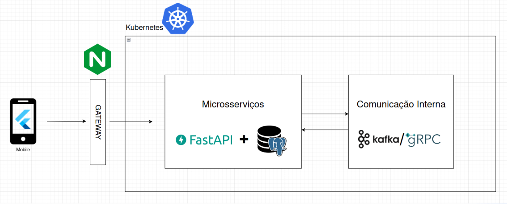

# Arquitetura da solução

A arquitetura do Asky foi projetada para fornecer uma solução robusta e escalável, que endereça as necessidades de comunicação e solicitação de urgências no sistema de reabastecimento de medicamentos no Hospital Sírio-Libanês. A infraestrutura é construída sobre o Kubernetes, oferecendo alta disponibilidade e permitindo a escalabilidade dos serviços. Esta documentação oferece uma visão detalhada da composição e interação entre os componentes da arquitetura.
Componentes da Arquitetura

## Alterações
Diante da nossa antiga arquitetura(encontrada na sprint 1), mudamos alguns quesitos para aumentar a escalabilidade do nosso projeto a fim de deixar de ser um monolito, tornando nossa arquitetura mais resistente nos testes de carga.

### O que mudou?

- **Container Backend e dos Simuladores(FastAPI)**: Separamos nossos serviços em micro serviços ao invés de apenas um grande monolito, adicionando aqui também os backends dos simuladores. A partir disso, adicionamos também o **NGINX** para ser nossa gateway.
  - **DB(SQL)**: Optamos por utilizar uma DB SQL após uma análise mais profunda dos dados, chegando a conclusão de que os dados estão devidamente estruturados e não vamos necessitar de um banco NoSQL para guardar nossos dados.
- **SocketIO**: Não utilizaremos mais o SocketIO, a partir disso, alteramos para um componente mais viável, o sistema de mensageria do firebase, já estruturado para o nosso Framework(Flutter).

Apesar dessas mudanças, o fluxo do sistema e de outros componentes continuam os mesmos.
