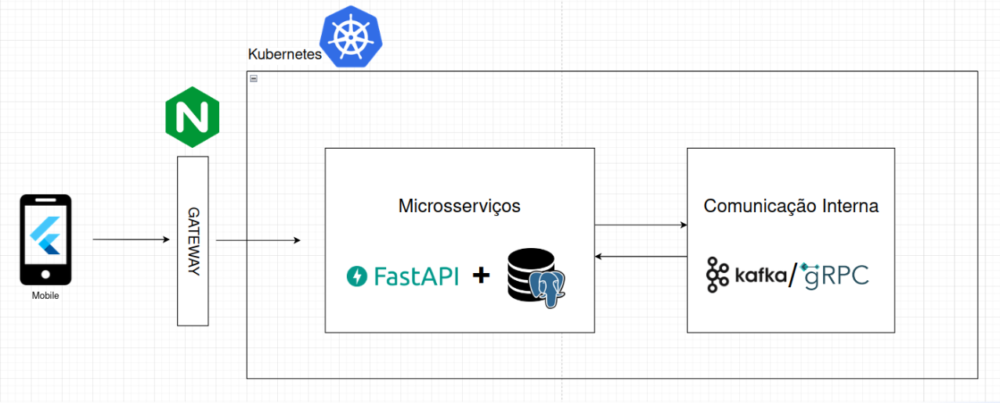

# Arquitetura do backend

Durante a segunda sprint, concentramos nossos esforços no desenvolvimento da versão inicial do backend, focando especialmente no processo de requisição de medicamentos. A prioridade foi estabelecer a infraestrutura para nossa arquitetura de microsserviços assíncronos. Iniciamos a implementação de um API Gateway e exploramos a comunicação através do RabbitMQ, entre outras tecnologias, adaptando do planejamento original que previa o uso de Socket.IO para uma abordagem mais robusta e escalável.

Nesse sentido, desde a Sprint 1, nossa arquitetura foi significativamente refinada e agora inclui um API Gateway implementado em nginx, uma série de microsserviços desenvolvidos em FastAPI com armazenamento de dados em Postgres, e comunicação síncrona realizada via HTTPS (e futuramente gRPC). A comunicação assíncrona é gerenciada através do RabbitMQ, enquanto a escalabilidade será assegurada por meio do Kubernetes nas próximas semanas, conforme ilustrado no esquema abaixo:



## Blocos do sistema

## API Gateway

A API Gateway utiliza Nginx para gerenciar as requisições HTTP e direcioná-las aos serviços apropriados. Ela atua como um ponto de entrada único para todos os microserviços, proporcionando balanceamento de carga, segurança e roteamento de requisições.

### Banco de Dados

Utilizamos um banco de dados centralizado com esquemas diferentes para isolar o acesso dos microserviços. Esta abordagem garante que cada serviço tenha acesso apenas aos dados necessários para sua funcionalidade. Os scripts SQL na pasta init-db são usados para inicializar o banco de dados com esquemas e dados mockados, permitindo testes e desenvolvimento inicial sem necessidade de dados reais.

### Estrutura Geral dos Microserviços

Cada microserviço segue uma estrutura geral composta por:

**Modelos (models):** Definem a estrutura dos dados e os esquemas do banco de dados.

**Serviços (services):** Contêm a lógica de negócios e interações com o banco de dados.

**Roteadores (routes):** Definem as rotas da API e lidam com as requisições HTTP.

**Main (main.py):** Ponto de entrada do serviço, onde a aplicação FastAPI é inicializada.

### Serviço de Autenticação (auth)
O serviço de autenticação é responsável por autenticar e autorizar os usuários. Utiliza JWT assinados assimetricamente, onde todos os microserviços possuem uma chave pública para verificar os tokens assinados pela chave privada do serviço de autenticação. Além disso, cada serviço possui um token próprio para fazer requisições autenticadas entre serviços. Este serviço inclui:

- main.py: Inicializa a aplicação FastAPI.
- routes/auth.py: Define as rotas para login e registro.
- services/auth.py: Contém a lógica de autenticação.
- models/users.py: Modelos de dados dos usuários.

### Serviço Pyxis (pyxis)

O serviço Pyxis gerencia informações de medicamentos, materiais e dispensadores eletrônicos. Ele também gera QR codes contendo informações de cada dispensador. Este serviço é essencial para facilitar a localização de itens. Inclui:

- main.py: Inicializa a aplicação FastAPI.
- routes/dispenser.py: Define as rotas para gerenciamento dos dispensadores.
- services/dispenser.py: Contém a lógica para manipulação dos dispensadores e geração de QR codes.
- models/dispenser.py: Modelos de dados dos dispensadores.

### Serviço de Gerenciamento de Solicitações (request_management)

Este serviço gerencia as requisições de medicamentos, materiais e assistência. Ele se comunica com o serviço Pyxis para obter dados dos medicamentos e com o serviço Auth para obter dados do usuário solicitante. A comunicação é feita via HTTP, com planos futuros de migração para gRPC. Após a criação de uma nova requisição, uma mensagem é publicada no RabbitMQ, permitindo que outros serviços respondam a esta ação. Inclui:

- main.py: Inicializa a aplicação FastAPI.
- routes/medicine_requests.py: Define as rotas para gerenciamento de solicitações.
- services/medicine_requests.py: Contém a lógica para manipulação das solicitações.
- models/medicine_requests.py: Modelos de dados das solicitações.

### Execução do Projeto
Para rodar o projeto, utilizamos o Docker Compose. O arquivo docker-compose.yaml na raiz do projeto orquestra os contêineres Docker dos diversos microserviços. Para iniciar todos os serviços, basta executar o comando:

```
docker-compose up --build
```

Este comando irá construir as imagens Docker e iniciar todos os contêineres definidos no arquivo de composição, configurando o ambiente completo do backend do Asky.


