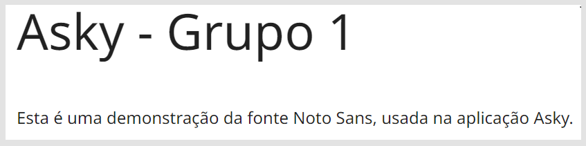

A prototipação de alta fidelidade é uma representação detalhada e quase final de um produto ou sistema, geralmente feita com o objetivo de simular o funcionamento e a aparência da versão final. Esses protótipos são criados com grande atenção aos detalhes visuais e interativos, utilizando elementos como cores, tipografia, imagens e animações para tornar a experiência o mais próxima possível da realidade.

Normalmente, a prototipação de alta fidelidade é feita após a fase de prototipação de baixa fidelidade ou wireframes, que são esboços mais simples e abstratos do design. A prototipação de alta fidelidade é útil para testar a usabilidade, a estética e a funcionalidade do produto com usuários reais antes do desenvolvimento final, permitindo identificar e corrigir problemas de forma mais eficiente e econômica.

## Cores

Foram utilizados tons de azul, que são as cores do cliente. Além do azul ser frequentemente associado à confiança, tranquilidade e segurança, o que pode ser reconfortante para os profissionais de saúde.

## Tipografia

A fonte escolhida foi a Noto Sans, que possui uma excelente legibilidade, o que é essencial em um ambiente onde informações precisas e claras são cruciais, como em um aplicativo hospitalar. Além de possuir um design limpo e profissional, o que pode ajudar a transmitir uma imagem de confiança e credibilidade para os usuários do aplicativo. Ela também foi otimizada para uso em telas de diferentes tamanhos e resoluções, garantindo uma boa legibilidade em smartphones, tablets e computadores, que são comumente usados em ambientes hospitalares.

## Demonstração de uso da interface

(https://github.com/Inteli-College/2024-1B-T02-EC10-G01/assets/99195612/d8b62355-3faa-4845-abdd-cf5e31bdb76c)

[Acesso ao Figma](https://www.figma.com/design/vUs3n8ymSo6Eoe8gf3u5kv/app-V1?node-id=0%3A1&t=7lEyxEwUJu6DWcx7-1)

