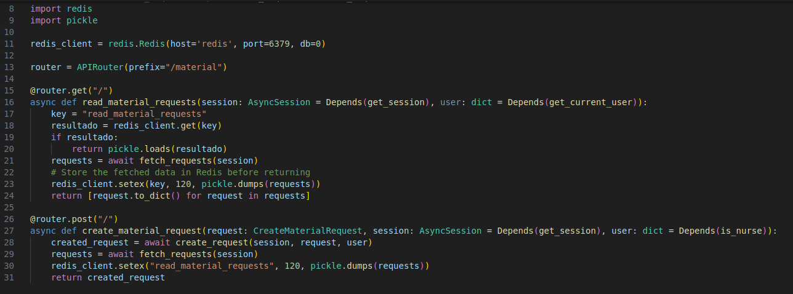
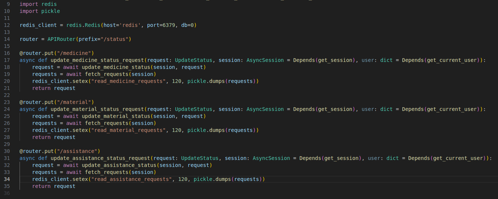

# Cache

## O que é?
O cache é um sistema interno a aplicação, que permite o acesso rápido as informações mais acessadas em um período de tempo. Ele reduz o número de acessos ao banco de dados e permite que a latência da aplicação seja reduzida, tornando a experiência do usuário mais agradável. Estas informações são armazenadas em um banco chave-valor em memória e o utilizado no caso foi o Redis.

## Implementação no Projeto
No projeto, cache foi implementado principalmente nas rotas de novas Requests, a fim de acelerar o fluxo dos enfermeiros e auxiliares. O Redis, serviço de cache utilizado, foi implementado como um microsserviço e é executado juntamente com os outros componentes da aplicação.

Ao receber requisições o Back-End verifica já existe o campo procurado no cache. Caso tenha, ele apenas verifica e retorna o valor, enquanto nos outros casos ele extrai os dados necessários do banco de dados e registra no cache. Como no exemplo abaixo:

O sistema também foi implementado na atualização de status, já que um valor valor deve ser atribído ao cache, toda vez que um campo no banco de dados receber um valor novo.

Além disso, os dados são registrados em formato de fluxo de bytes, a fim de facilitar o acesso, armazenamento e transformação dos dados.

