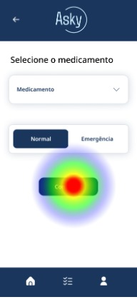

# Teste de Usabilidade

Um teste de usabilidade é um método utilizado para avaliar a facilidade de uso de um produto ou sistema, como um site, aplicativo ou software. Durante o teste, usuários reais interagem com o produto enquanto são observados por pesquisadores ou desenvolvedores. O objetivo é identificar problemas de usabilidade e coletar dados qualitativos e quantitativos sobre a interação dos usuários com o sistema.

Esses testes melhoram a Experiência do Usuário (UX), ajudando a identificar e resolver problemas, aumentando a eficiência ao permitir que os usuários realizem tarefas de forma mais rápida e eficiente, reduzindo o tempo necessário para completar ações e diminuindo a frustração. Além disso, revelam pontos onde os usuários cometem erros, permitindo ajustes para evitar esses erros e melhorar a precisão das interações.

Em resumo, os testes de usabilidade são essenciais para garantir que um produto atenda às necessidades dos seus usuários, proporcionando uma experiência positiva e eficiente.

## Composição do Teste
Objetivos do Teste: Definir o que se quer descobrir com o teste, como a facilidade de navegação, a eficiência na realização de tarefas específicas ou a satisfação do usuário.

- Tarefas: Criar tarefas representativas que os usuários deverão realizar, baseadas em ações comuns de um usuário típico no sistema.

- Participantes: Selecionar um grupo de participantes que represente os usuários-alvo do produto. A diversidade de participantes ajuda a identificar uma variedade maior de problemas.

- Ambiente de Teste: Configurar um ambiente onde os participantes possam interagir com o sistema de forma natural, seja presencialmente ou remotamente.

- Observação e Coleta de Dados: Observar como os participantes realizam as tarefas, anotando onde encontram dificuldades, quanto tempo levam e como se sentem ao usar o produto. Ferramentas de gravação de tela e áudio podem ser usadas para capturar interações detalhadas.

- Análise dos Dados: Analisar os dados coletados para identificar padrões, problemas recorrentes e áreas que necessitam de melhorias.

## Objetivos do Teste
Os objetivos do teste de usabilidade foram definidos através do framework HEART, desenvolvido pelo Google para medir e melhorar a experiência do usuário em produtos digitais. Este framework é composto por cinco dimensões principais:

- Happiness (Felicidade): Avalia a satisfação do usuário através de feedbacks subjetivos.
- Engagement (Engajamento): Mede o nível de interação do usuário com o produto.
- Adoption (Adoção): Verifica quantos novos usuários começam a utilizar o produto em um determinado período.
- Retention (Retenção): Avalia quantos usuários continuam a usar o produto ao longo do tempo.
- Task Success (Sucesso nas Tarefas): Mede a eficácia e eficiência com que os usuários completam tarefas específicas.

## Tarefas
As tarefas foram criadas considerando os dois principais usuários da solução: enfermeiros e auxiliares de farmácia.

Para os enfermeiros, o foco foi a criação de requisições com diferentes níveis de prioridade e tipos de itens solicitados, além do acompanhamento dessas solicitações.

- Abrir uma solicitação de medicamento normal.
- Abrir uma solicitação de material emergencial.
- Abrir uma solicitação de assistência.
- Abrir o detalhamento de uma solicitação por meio da listagem.

Para os auxiliares de farmácia, o foco foi o acompanhamento das solicitações, com a necessidade de realizar mudanças de status de cada pedido conforme a execução de suas tarefas, informando os enfermeiros sobre o andamento dos pedidos.

- Realizar o aceite de uma solicitação e progredir seu status até a conclusão.

## Público-alvo do Teste
O teste foi realizado entre os membros da classe, que estão familiarizados com as tarefas desempenhadas por cada tipo de usuário, mas não possuem conhecimento prévio do wireframe desenvolvido pelo grupo. Isso garante que eles possam avaliar o wireframe de forma imparcial, sem influências de um entendimento prévio da estrutura da tela.

## Ambiente de Teste e Coleta de Dados
Para garantir uma coleta de dados abrangente e precisa, foi utilizada a plataforma de testes Maze. Esta ferramenta permite que o protótipo seja apresentado aos usuários junto com as tarefas a serem realizadas, capturando dados como tempo de inatividade em uma única tela, cliques incorretos e mapas de calor. Esses dados facilitam a identificação de pontos críticos rapidamente, visualizando o percurso de cada usuário durante o teste e verificando se erros são recorrentes entre diferentes usuários. Além disso, foram incluídas perguntas de satisfação e feedback, possibilitando a obtenção de um nível médio de satisfação e felicidade com o design atual, bem como sugestões de melhorias que podem ser implementadas.

## Resultados
O teste foi realizado com 18 pessoas e esses foram os resultado mais relevantes referentes a cada tipo de usuário:

### Enfermeiro

#### Criar solicitação
Para criar uma solicitação, os usuários enfrentaram algumas dificuldades iniciais, resultando em um alto nível de sucesso indireto. Analisando detalhadamente o percurso de cada usuário, foi identificado um problema na compreensão de que o componente de seleção era um dropdown. Isso levou os usuários a clicarem diretamente no botão de prosseguir antes de selecionar um item, causando confusão e dificultando a conclusão da tarefa.

    

#### Abrir detalhamento pela listagem
Na tarefa de abrir o detalhamento de uma solicitação por meio da listagem, não tivemos testes interrompidos, mas observamos um aumento significativo de cliques errados (missclicks). Isso ocorreu porque a tela principal também permite acessar o detalhamento, mas apenas da última solicitação feita. Apesar da tarefa ter sido especificada como sendo pela tela de listagem, os usuários ficaram confusos.

    

### Auxiliar

A tarefa do auxiliar consistia em aceitar uma solicitação e atualizar os status de forma progressiva até a conclusão. Os resultados foram excelentes, com os usuários demonstrando facilidade em compreender e utilizar essa funcionalidade.

