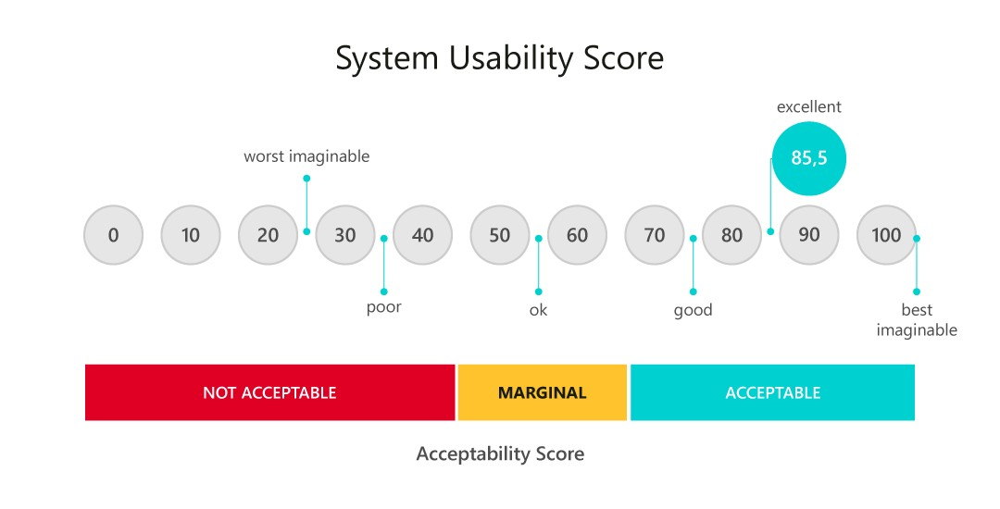

# Testes de Usabilidade

Para começarmos a realizar testes reais dos nossos fluxos já integrados na nossa aplicação, desenvolvemos alguns testes de usabilidade do fluxo de enfermeiro para entender como os usuários se comportariam no nosso fluxo atual. Testes de usabilidade são realizados para avaliar a facilidade de uso e a experiência do usuário ao interagir com um produto, serviço ou sistema, como um site, aplicativo, software ou dispositivo. Eles são fundamentais para garantir que o produto seja eficiente, eficaz e satisfatório para os usuários finais. 

## Público-alvo do Teste

O teste foi realizado entre os membros da classe, que estão familiarizados com as tarefas desempenhadas por cada tipo de usuário, mas não possuem conhecimento prévio de como a aplicação foi desenvolvida pelo grupo. Isso garante que eles possam avaliar o fluxo de forma imparcial, sem influências de um entendimento prévio da estrutura da tela.

## Métricas

Para realizar esses testes, utilizamos uma métrica chamada System Usability Scale, também conhecida como SUS. Esta métrica consiste em um questionário com 10 itens, que os usuários respondem após utilizarem o produto. Cada item é uma afirmação que os usuários avaliam em uma escala de 1 a 5, onde 1 significa "discordo totalmente" e 5 significa "concordo totalmente". O SUS é simples, eficiente, flexível e permite comparações com outras versões da aplicação.

    

## Resultados

Ao realizar o teste deste primeiro fluxo, utilizamos uma base de 10 participantes para obter um entendimento inicial dos dados. Obtivemos uma pontuação média de 73,2 pontos de 100, enquadrando-se na categoria de "Boa usabilidade" segundo a métrica SUS. 

## Próximos Passos

Para melhorar a usabilidade e o entendimento do usuário, planejamos:
- Ajustar detalhes do fluxo para torná-lo mais intuitivo.
- Tornar as informações mais claras e acessíveis.
- Finalizar os demais fluxos da aplicação.

A principal reclamação dos usuários foi a complexidade para entender o sistema. Apesar disso, obtivemos uma boa pontuação considerando a métrica utilizada. Continuaremos a iterar e aprimorar nosso design com base no feedback recebido para proporcionar uma experiência ainda melhor aos nossos usuários.